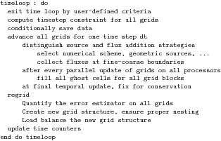
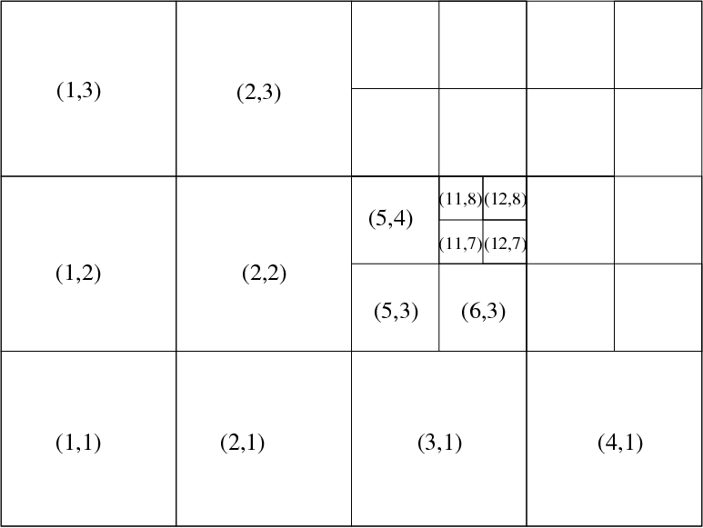
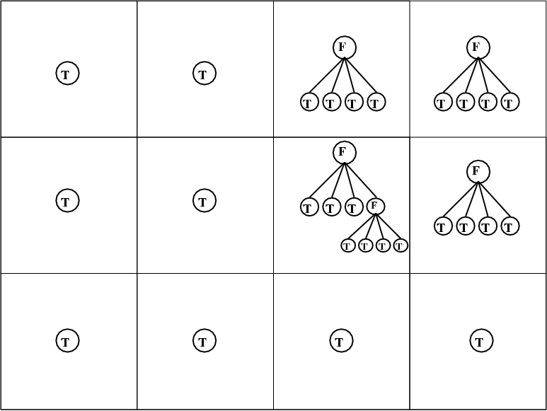
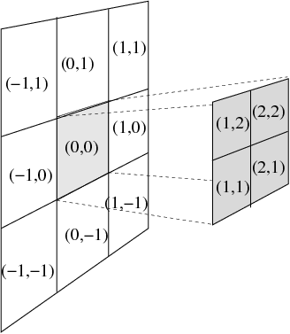
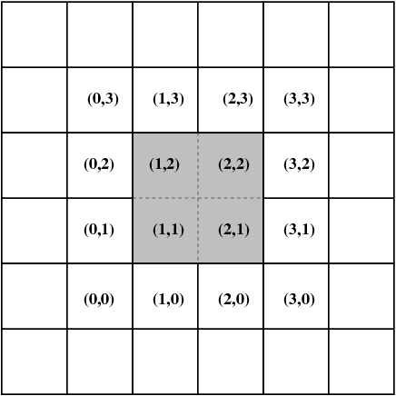
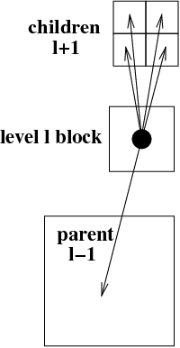
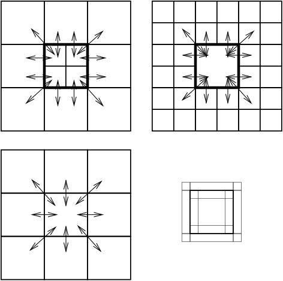
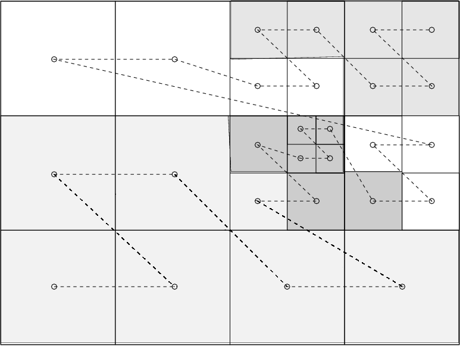
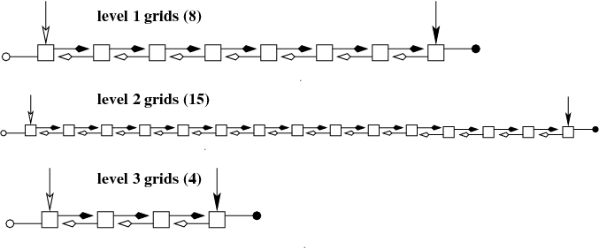

# Adaptive Mesh Refinement

## Introduction

This document briefly describes the AMR-related features in MPI-AMRVAC. The
different options can be set in the meshlist part (see @ref par.md) of the
**amrvac.par** file. For a more extensive description, you can read the article
'Parallel, grid-adaptive approaches for relativistic hydro and
magnetohydrodynamics', R. Keppens, Z. Meliani, A.J. van Marle, P. Delmont, A.
Vlasis, &amp; B. van der Holst, 2011, JCP.*
[doi:10.1016/j.jcp.2011.01.020](http://dx.doi.org/10.1016/j.jcp.2011.01.020).

MPI-AMRVAC uses a standard block-based, octree AMR scheme, where we have
blocks of user-controlled dimension (set by the block_nx1, block_nx2, block_nx3) 
in a hierarchically nested manner. To simplify the parallelization, we gave up
flexibility to allow different sized refinement ratios between grid levels,
fixing it to 2. Also, we now use the same time step for all levels. A generic
skeleton code, generic enough to hold for any AMR code having similar
restrictions, is shown below.

Some more info follows on the different aspects involved.

## Important (global) parameters

Some important global parameters are in the module _mod_global_parameters.t_. 
In particular, note that the maximum number of blocks per processor is the
parameter **max_blocks**, and the maximum number of levels is the parameter
**nlevelshi**. The latter is default set to 20. If your want to run with more
levels, and/or allow for more grids per processor, you need to change their
value and recompile. The number of levels set in the par file as
_refine_max_level_ must always be smaller or equal to **nlevelshi**. 
This **nlevelshi** also returns in those parameters that are defined per 
level, such as _limiter_ which needs to be set for all (default) 20 levels.

## AMR criteria

This in essence describes the module _errest.t_, or at least its most
essential aspets.

The block-tree nature implies that a decision for refining/coarsening is to be
made on a block-by-block basis. This automated block-based regridding
procedure involves 3 steps:

    (1) consider all blocks at level 1< l< _refine_max_level_ , with _refine_max_level_ the maximal grid level selected;
    (2) quantify the local error E_\xx at each gridpoint in a certain grid block;
    (3) if any point has this error exceeding a user-set threshold _refine_threshold(l)_, refine this block (and ensure proper nesting);
    (4) if all points have their error below a user-set fraction of the threshold _derefine_ratio(l)_ used in the previous step, coarsen the block (for l>1).

The local error estimator can be one of four options, selected by
_refine_criterion_, each possibly augmented with user-defined criteria. For _refine_criterion=1_, only refinement based on _usr_refine_grid_ is active. Any of
the other 3 estimators use a user-selected subset of the conserved or auxiliary
variables (or even variables that are computed dynamically at the time of
regridding), through the formula  

The indices included are user-identified with the _w_refine_weight_ array, where the sum of
 weights of all variables should equal to 1. The estimated error is a weighted sum
of contributions from all variables with non-zero weight.

For _refine_criterion=2_ or _refine_criterion=3_, we select a Lohner type [R. Lohner, An adaptive finite element
scheme for transient problems in CFD, Comp. Meth. App. Mech. Eng. 61, 323
(1987)] prescription as also used in the PARAMESH library or the FLASH3 code.
In our experience, it does not require any of the buffering just discussed,
and is computationally efficient as it employs only instantaneous values from
t^n. It in essence discretizes a weighted second derivative in each grid
point. 

The _refine_criterion=3_ is also Lohner prescription, which writes in formulae as  

where the operators mean a central difference and a sum, per dimension. The wave filter parameter is set per level, and defaults as _amr_wavefilter(1:nlevelshi)=1.0d-2_.

## Data structures

The data structures are defined in _mod_physicaldata.t_ and _mod_forest.t_,
you can inspect them for learning more details.

We provide details on useful data structures. All of these are suited for any
curvilinear coordinate system, and merely reflect the tree structure of the
block-AMR. We implicitly assume a fixed refinement ratio of two. Schematic
figures for a 2D Cartesian case generalize straightforwardly to higher or
lower dimensionality.

The overall domain is considered 'rectangular', i.e. bounded by coordinate
pairs _xprobmin1,xprobmax1, ..._ in each dimension. On the lowest grid level
l=1, one controls the coarsest resolution as well as a suitable domain
decomposition, by specifying both the total number of level 1 grid cells
_domain_nx1, ..._ along with the individual block size per dimension 
_block_nx1, ..._, which exclude the ghost cells. The total cell number must 
be an integer multiple of the block size, so e.g., domain_nx1=4 block_nx1. 

A hypothetical 2D domain is shown below, which corresponds to a domain where 4
by 3 blocks on level 1 are exploited in this domain decomposition, and where
local refinement was activated in 4 out of these level l=1 blocks, here in the
top right domain corner, as well as in one level l=2 grid.
 Global, integer grid indices are introduced per
dimension, in a manner where knowledge of these grid indices, combined with
AMR level knowledge, instantly allows one to localize the grid when needed.
Following the figure, the grid on level l=2 indicated by global grid indices
(5,3) is indeed the fifth grid block horizontally, and the third vertically,
when the domain would be resolved fully with level l=2 blocks. The total
amount of grid blocks per dimension, per level l, is stored in _ng^D(l)_, and
the actual length of a grid block on level l, per dimension, is _dg^D(l)_.

The bottom figure reflects the tree representation of the same hypothetical
grid hierarchy, where the presence of a grid leaf at a certain grid level is
identified through a boolean variable. As indicated before, the total number
of active grid leafs _nleafs_ may change from timestep to timestep. This tree
info is stored in the structure _tree_root(ig^D(l))_, which knows about the
global grid index through _tree_root(ig^D(l))%node%ig^D_, the level
_tree_root(ig^D(l))%node%level_, the processor on which it resides through the
integer _tree_root(ig^D(l))%node%ipe_, and its presence or absence in the
logical _tree_root(ig^D(l))%node%leaf_. 

Various extra indices are helpful to traverse the tree structure. Local grid
indices across AMR levels are schematically given below, which are used to
identify the directional neighbours, as well as the children and parent
blocks. These are used to realize and facilitate the possible interprocessor
communication patterns, which are schematically shown at right.

The directional neighbours of a grid block are shown for a 1D, 2D and 3D case
in the picture below. 

For parallelization, we adopted a fairly straightforward Z-order or Morton-
order space filling curve (SFC). For the same hypothetical grid structure shown
previously, the Morton space-filling curve is illustrated below, along with
the resulting distribution of these 27 grid blocks on 4 CPUs. Load-balancing
is done after every timestep, following the adaptive remeshing. When
exploiting N_p CPUs, our strategy for load balancing merely ensures that each
CPU has at least [nleafs/N_p]_int (denoting integer division) grid blocks,
while the remainder increase this number by 1 for the first as many CPUs. In
the example shown, this implies that the first 3 CPUs each contain 7 grid
blocks, while the fourth has 6. The grid Morton numbers of all grids residing
on processor _mype_ lie between _Morton_start(mype),Morton_stop(mype)_. The
global grid index, once you know the grid Morton number _Morton_no_ is found
from _sfc_to_igrid(Morton_no)_, which gives the relation between the SFC
and the global grid index _igrid_. The data for the
conservative variables for grid _igrid_ is then actually found from
_pw(igrid)%w_. 

Some operations benefit from having a linear, linked list possibility to
traverse the tree on a level by level basis. To that end, each grid also
contains a pointer to the previous and next grid created in the same AMR
level, taking all grids on all processors into account. This linked list is
complemented with a globally known pointer to the first (head) and last (tail)
grid on each level. For the hypothetical grid structure used above, this
corresponding linked list representation is shown next.

