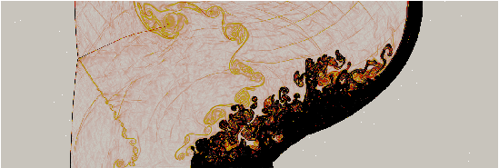
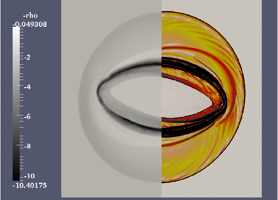
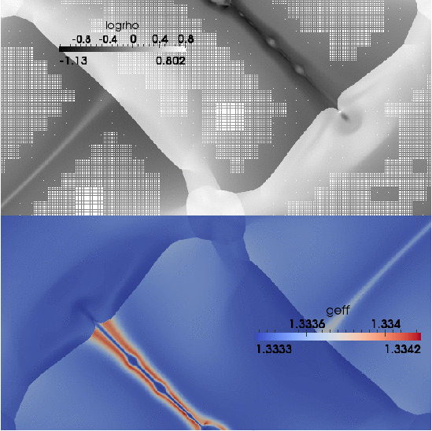

# Example simulations

This document describes a few relatively simple example simulations which can
be done based on some readily available **src/usr/amrvacusr.t.*** files, along
with their **par/*** files, which are part of the subversion MPI-AMRVAC
release. See AMRVAC_Man/[USAGE](USAGE.html) for a more complete description on
how to use the code.

_The commands on this page are still for the old svn version. See the
$AMRVAC_DIR/tests folder for a plethora of tests with the git version._

## Advection tests

Configure MPI-AMRVAC to the standard 2D [advection
equation](equations.html#RHO) test as follows:

    cd src
    setamrvac -d=22 -phi=0 -z=0 -g=16,16 -p=rho -u=testrho -s
    make clean amrvac
    cd ..
    ln -s par/testrho/testrho_vac22 amrvac.par
    mpirun -np 1 amrvac

This test uses the _src/usr/amrvacusr.t.testrho_ amrvacusr-module, which
contains several tests, distinguished by **iprob**. In the above setting, it
will use **iprob=3** as specified in the [&amp;amrlist;](par.html#Amrlist) and
do a 2D advection of the VAC-logo on a double periodic domain, on the unit
square. After [converting](convert.html) the 21 data files created to the VTK
format suited for paraview visualization, you will be able to make the
following movie in a few simple steps:

Its default settings is to perform one advection over the full diagonal, use 3
AMR levels, and have a base level 1 resolution of 24 by 24 (split in four 12
by 12 grid blocks). A somewhat more advanced paraview user can make the
following movie, combining the 2D view with a cut along the middle of the box:

A 3D variant is to do the advection of a sphere along the diagonal of a cube.
This is selected by (**iprob=6** in the _par/testrho/testrho_ball33_ file)

    cd src
    setamrvac -d=33 -phi=0 -z=0 -g=16,16,16 -p=rho -u=testrho -s
    make clean amrvac
    cd ..
    ln -s par/testrho/testrho_ball33 amrvac.par
    mpirun -np 1 amrvac

Use now the data conversion and paraview to make the following movie:

**We note that the _src/usr/amrvacusr.t.testrho_ actually codes up 6 different tests, some of them realizable in any dimensionality. You are encouraged to make the corresponding par-files for these tests, and use these tests to investigate different discretization methods, different settings for the AMR strategy, etc, on problems for which you know the exact solution.**

## Isothermal HD test

The first test shown here is a 1D test case recovering the analytic solution
for the collision of two pressureless dust clouds, as described in the paper
by Leveque, R.J., Journal of Hyperbolic Differential equations, Vol.1, No.2
(2004), 315-327. The test is ideally suited for AMR simulations, since the
correct analytic solution is known to contain delta-type waves
(shocks/rarefactions). This test uses the [adiabatic hydro
module](equations.html#HDADIAB).

    cd src
    setamrvac -d=11 -phi=0 -z=0 -g=16 -p=hdadiab -u=testhdadiab -s
    make clean amrvac
    cd ..
    ln -s par/testhdadiab/testleveque amrvac.par
    mpirun -np 1 amrvac

This will run problem **iprob=19** out of the 19 precoded tests, and after
converting and visualizing (with Idl this time), you should be able to recover
the behaviour below (note the vertical scale on the axis, clipping the delta-
wave peaks away).

A second, 2D test runs **iprob=1** by doing

    cd src
    setamrvac -d=22 -phi=0 -z=0 -g=16,16 -p=hdadiab -u=testhdadiab -s
    make clean amrvac
    cd ..
    ln -s par/testhdadiab/khadiabA amrvac.par
    mpirun -np 1 amrvac

It sets up a sheared horizontal velocity field (a _tanh_ profile), augmented
with a small sinusoidal vertical displacement centered on the velocity shear
region. This situation is Kelvin-Helmholtz unstable, and a vortical flow
pattern develops. After converting and using paraview, you can create frames
as shown below (or make a [movie](figmovdir/khadiabA.avi)).

 

## HD tests

The distributed MPI-AMRVAC contains various example _amrvacusr.t.*_ and
corresponding _par/testhd/*_ files realizing relatively standard test cases
for [hydrodynamics](equations.html#HD). They include

    src/usr/amrvacusr.t.wchd22
    src/usr/amrvacusr.t.bowhd22
    src/usr/amrvacusr.t.testhdrt
    src/usr/amrvacusr.t.rimhd22
    src/usr/amrvacusr.t.poletest
    src/usr/amrvacusr.t.liska

and the corresponding par-files

    par/testhd/wchd22
    par/testhd/bowhd22
    par/testhd/testhdrt22  and  par/testhd/testhdrt33
    par/testhd/rimhd22
    par/testhd/poletest_lohner
    par/testhd/liska_tvdlf

Some are meant to be run in 2D only, some can be set up in 2D and 3D,
sometimes requiring suitable adaptations in the par-files provided. The first
one listed is the Woodward and Collela shock reflection problem, on a 2D
cartesian grid. It is a nice illustration on how to code up some non-trivial
special boundary conditions (spatio-temporally varying). The second is a
supersonic flow hitting a cylinder, and demonstrates the use of a cylindrical
grid. The third can be run in 2D and 3D, and uses an external constant
gravitational field to simulate the development of a Rayleigh-Taylor
instability when a heavy density gas rests on top of a light one. The fourth
test concentrates on the Richtmyer-Meshkov variant of the Rayleigh-Taylor
instability, by letting a shock impinge on an inclined density discontinuity.
The fifth test does a standard 1D Riemann problem (the Sod problem) on a 2D
polar grid, to show how the boundary conditions need to be set for a symmetry
axis. The final test could be run in 2D and 3D, and studies the multiple
reflection of shocks in a box, where one can vary the schemes at will, to see
how the small-scale structure (combinations of Richtmeyer-Meshkov and Kelvin-
Helmholtz behaviour) are influenced by resolution, discretization etc. It is
also useful to see which schemes maintain the symmetry about the diagonal.

Impressions for some of these tests are shown below:

 

This Rayleigh Taylor test (july 2011) can be repeated with 7 refinement
levels, it then takes 11375 seconds (on a 4 CPU macBook pro, a bit over 3
hours, all IO included). The movie and figure for that run is 

The latter `liska' test is a nice one to test symmetry-preserving properties
for schemes, and to compare effects of resolution (by raising the number of
AMR levels). On my MacBook Pro (june 2011), a quadcore CPU with 8GB memory, I
can run a 6 level version (base resolution 24 x 24) up to time t=2.5 in less
than 12000 seconds (slightly over 3 hours). The movie for that run is [shown
here](figmovdir/liska.avi).

## MHD tests

The _src/usr/amrvacusr.t.testmhd_ codes up a large variety of standard test
cases for [MHD](equations.html#MHD), going from 1D Riemann problems to tests
doable in 2D and 3D. For some, you will find appropriate par-files in the
_par/testmhd_ subdirectory. You are encouraged to study the files and make
testruns for MHD problems.

One of the tests is the Orszag-Tang test, in the compressible regime, for
which an animation is shown below.

The Orsaz-Tang test is again nice to test symmetry-preserving properties for
schemes, and to compare effects of resolution (by raising the number of AMR
levels). On my MacBook Pro (june 2011), a quadcore CPU with 8GB memory, I can
run a 6 level version (base resolution 48 x 48) up to time t=6.28 in less than
24000 seconds (slightly under 7 hours). The movie for that run is [shown
here](figmovdir/ot_VHR.avi).

Another representative MHD problem is the GEM challenge, realizing
reconnection in resistive MHD. The problem is described e.g. in the book
`Advanced Magnetohydrodynamics. With applications to laboratory and
astrophysical plasmas.', J.P. (Hans) Goedbloed, Rony Keppens, &amp; Stefaan
Poedts, 2010, Cambridge University Press, 634 pages, [ISBN 9780521705240
(Paperback)](http://www.cambridge.org/uk/catalogue/catalogue.asp?isbn=9780521705240).
We show here the case with resistivity parameter set to 0.001.

## Relativistic tests

Several of the tests for relativistic hydro and MHD have been run with the
present version of the code. Especially all tests described in `Parallel,
grid-adaptive approaches for relativistic hydro and magnetohydrodynamics', R.
Keppens, Z. Meliani, A.J. van Marle, P. Delmont, A. Vlasis, &amp; B. van der
Holst, 2011, JCP.
[doi:10.1016/j.jcp.2011.01.020](http://dx.doi.org/10.1016/j.jcp.2011.01.020).
You can contact the developers in case you want to get some specific userfile,
par-file combination for future work, which we then hope will lead to
collaboration. Some figures and impressions are collected below. For full
descriptions, we hope you consult the above paper.

Shock reflection on polar grid, relativistic hydro

Two component jet evolution on cylindrical grid, relativistic hydro

2D Richtmyer Meshkov, relativistic hydro

2D Rotor, relativistic MHD

2D Friedrichs diagram, relativistic MHD

2D Orszag Tang, relativistic MHD

A test not found in the above paper, but relevant for much of the work we do
on relativistic jet modeling, is the jet model from the original Marti et al.
(ApJ 479, 151, 1997) work. The case there indicated as C2, has been modeled
and visualized in this [movie](figmovdir/martiC2BW.avi).

